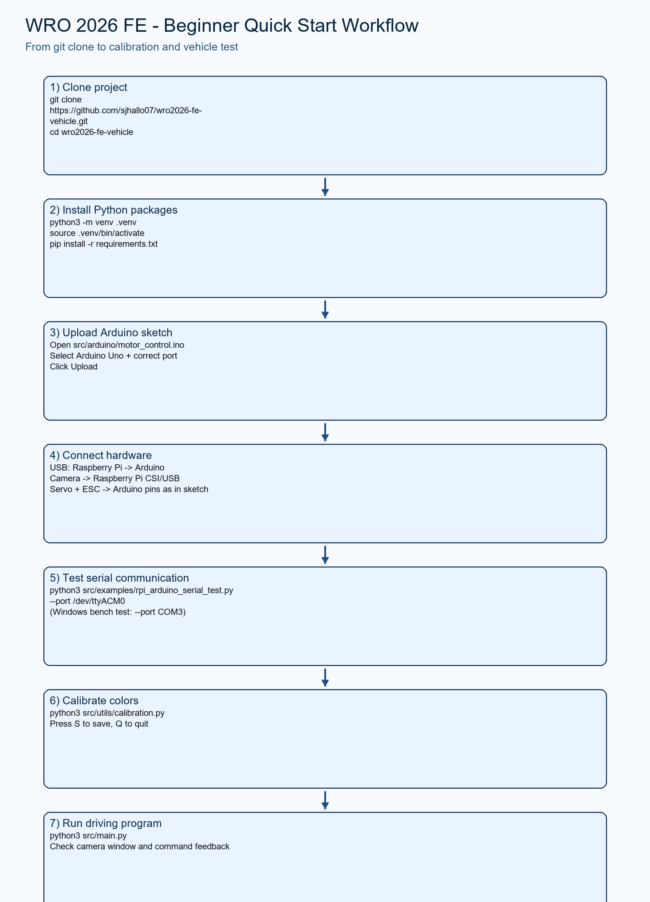
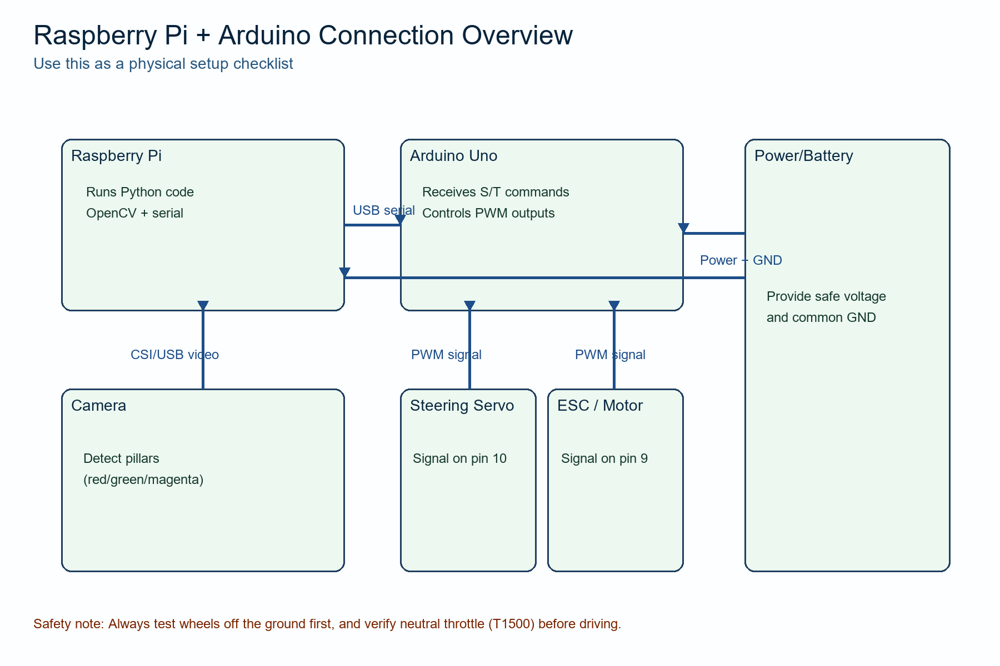

# WRO 2026 Future Engineers Vehicle (Beginner Friendly Guide)

**Language:** English | [Español](README.es.md)

Welcome! 👋  
This repository is designed for students (including mechanical engineering teams)
who may have **little programming experience**.

If you can follow a checklist, you can run this project.

---

## What this project does (in simple words)

- Uses a **Raspberry Pi camera** to detect colors (red, green, magenta).
- Sends commands to an **Arduino Uno** over USB serial.
- Arduino controls:
  - steering servo (`S...` commands)
  - throttle/ESC (`T...` commands)

---

## Visual roadmap (from clone to run)

### 1) Full workflow



### 2) Connection overview



---

## Before you start (hardware + software checklist)

### Hardware

- Raspberry Pi (with Raspberry Pi OS)
- Arduino Uno
- USB cable (Pi ↔ Arduino)
- Camera module or USB camera
- Steering servo
- ESC + motor
- Battery / power source

### Software

- Git installed
- Python 3 installed
- Arduino IDE installed

---

## Step-by-step instructions

## Step 1 — Clone this repository

On Raspberry Pi terminal:

```bash
git clone https://github.com/sjhallo07/wro2026-fe-vehicle.git
cd wro2026-fe-vehicle
```

---

## Step 2 — Install Python dependencies

### Raspberry Pi / Linux

```bash
python3 -m venv .venv
source .venv/bin/activate
pip install -r requirements.txt
```

### Windows (optional bench testing)

```bash
python -m venv .venv
.venv\Scripts\activate
pip install -r requirements.txt
```

---

## Step 3 — Upload Arduino firmware

1. Open Arduino IDE.
2. Open file: `src/arduino/motor_control.ino`
3. Select board: **Arduino Uno**
4. Select the correct port (example: `COM3` on Windows).
5. Click **Upload**.

When connected, Arduino should send `ARDUINO_READY` on serial.

---

## Step 4 — Connect Raspberry Pi and Arduino

Minimum required connections:

- Raspberry Pi to Arduino via **USB** (serial communication).
- Camera connected to Raspberry Pi.
- Servo signal to Arduino pin **10**.
- ESC signal to Arduino pin **9**.
- Use proper power and **common GND**.

⚠️ Safety first: test with wheels off the ground before full driving.

---

## Step 5 — Test serial communication (important)

Run this on Raspberry Pi:

```bash
python3 src/examples/rpi_arduino_serial_test.py --port /dev/ttyACM0
```

Optional stress test example (3 cycles, slower pacing):

```bash
python3 src/examples/rpi_arduino_serial_test.py --port /dev/ttyACM0 --repeats 3 --delay 1.0
```

Windows example:

```bash
python src/examples/rpi_arduino_serial_test.py --port COM3
```

If working, you should see responses like:

- `STEER:90`
- `THROTTLE:1500`

---

## Step 6 — Calibrate camera colors

Run:

```bash
python3 src/utils/calibration.py
```

How to use:

- Move trackbars until mask detects your target color correctly.
- Press **S** to save.
- Press **Q** to quit.

Do this whenever lighting changes.

---

## Step 7 — Run the main vehicle program

```bash
python3 src/main.py
```

What to expect:

- Camera window opens.
- Color detections appear.
- Actions map to Arduino commands:
  - `FORWARD` → `S90`, `T1600`
  - `LEFT` → `S60`, `T1550`
  - `RIGHT` → `S120`, `T1550`
  - `STOP` → `T1500`, `S90`

### Useful run modes (new)

The current `src/main.py` supports extra flags for testing and deployment:

```bash
# Logic-only check (no camera/Arduino required)
python3 src/main.py --dry-run

# Vision only (camera on, serial off)
python3 src/main.py --no-serial

# Custom serial port / baud / camera index
python3 src/main.py --port /dev/ttyUSB0 --baud 115200 --camera 0
```

Windows equivalent examples:

```bash
python src/main.py --dry-run
python src/main.py --no-serial
python src/main.py --port COM3 --baud 115200 --camera 0
```

---

## Demo video links (competition evidence)

Add your official test videos here before submission:

- Open Challenge video: `[Add YouTube link here]`
- Obstacle Challenge video: `[Add YouTube link here]`
- Parking / final maneuver video (optional): `[Add link here]`

Recommended recording tips:

- Show the full robot and field in one frame when possible.
- Keep one unedited full-run video for each challenge.
- Mention software version/date in the video description.
- Keep backup files locally and in cloud storage.

---

## Do we need AI model training?

Short answer: **No, training a neural network is not mandatory**.

This project uses classic computer vision (HSV color segmentation), which is a
valid and practical approach for WRO Future Engineers. For most teams, this is
faster to develop and easier to debug than deep-learning pipelines.

When to consider AI training anyway:

- Lighting is extremely unstable and color masks become unreliable.
- You need object recognition beyond simple colored pillars.
- Your team has enough time for data collection + model testing.

If you stay with HSV + good calibration + strong control logic (FSM/PID), you
can still build a competitive solution.

---

## WRO repository checklist before submission

Use this as a final checklist before sending the repository link:

- [ ] README is complete and clear (architecture + setup + run + troubleshooting).
- [ ] Arduino and Raspberry Pi code are both included.
- [ ] Wiring and CAD files are uploaded (`wiring/`, `cad/`).
- [ ] Engineering notes/journal are uploaded in `docs/`.
- [ ] Demo video links are added in this README.
- [ ] Repository is public and accessible without login issues.
- [ ] Commit history shows real progress (not one giant final commit only).

Suggested progress milestones (good practice):

1. First implementation milestone (basic motion + camera stream).
2. Mid milestone (obstacle handling and improved control).
3. Final milestone (stable run + documentation + videos).

Keep commit messages meaningful, for example:

- `feat: add serial protocol for steering and throttle`
- `fix: adjust HSV ranges for indoor light`
- `docs: add challenge test videos and wiring notes`

---

## Quick troubleshooting (common student issues)

### 1) `Could not connect to Arduino`

- Check USB cable.
- Check port (`/dev/ttyACM0` or `COMx`).
- Close Arduino Serial Monitor (it can lock the port).

### 2) Camera not detected

- Verify camera cable.
- Try another camera index in code if needed.

### 3) Wrong color detection

- Re-run calibration (`src/utils/calibration.py`).
- Improve lighting consistency.

### 4) Servo/motor does not move

- Check power wiring.
- Confirm Arduino pins match sketch (`10` and `9`).
- Confirm ESC/servo grounds are common with Arduino.

### 5) Python package import errors (`cv2`, `serial`, `numpy`)

- Activate `.venv` first.
- Re-run `pip install -r requirements.txt`.

---

## Repository structure

```text
wro2026-fe-vehicle/
├── README.md
├── requirements.txt
├── src/
│   ├── main.py
│   ├── arduino/
│   │   └── motor_control.ino
│   ├── examples/
│   │   └── rpi_arduino_serial_test.py
│   └── utils/
│       └── calibration.py
├── cad/
├── wiring/
└── docs/
    └── diagrams/
        ├── 01_quick_start_workflow.png
        └── 02_connection_overview.png
```

---

## For teachers/mentors

This README is intentionally explicit and procedural so students can follow it
without strong coding background. You can turn each step into a lab checkpoint.
